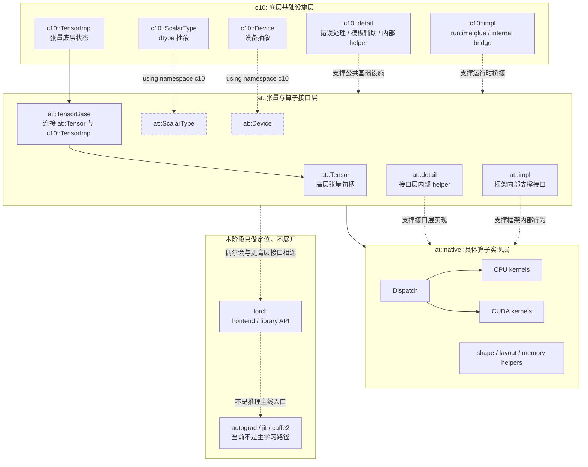

# PyTorch Namespace 文档

## 1. 概述

### 问题与难点

刚开始读 PyTorch C++ 代码时，最容易让人失去方向感的不是某个具体类或某个具体算子，而是名字前面的那一串 namespace。[`at::Tensor`](../../aten/src/ATen/templates/TensorBody.h#L65-L120)、[`c10::Device`](../../c10/core/Device.h#L13-L46)、[`torch::CppFunction`](../../torch/library.h#L71-L150)、[`c10::detail::torchCheckFail`](../../c10/util/Exception.h#L492-L520) 看起来都属于同一个项目，但显然不在同一个抽象层次上。如果只把 namespace 当成”防止重名的语法机制”，阅读体验会非常割裂，因为你会不断遇到这样的疑问：为什么 `Tensor` 在 `at`，而底层实现对象 [`c10::TensorImpl`](../../c10/core/TensorImpl.h#L65-L190) 在 `c10`；为什么有些类型明明定义在 `c10`，却经常以 `at::` 的名字出现；为什么 `detail` 和 `impl` 到处都在，但又不像是应该直接依赖的公共接口。

PyTorch 不是从零开始按单一风格生长出来的代码库，而是经历了 ATen、c10、torch frontend、autograd、JIT、caffe2 兼容层长期叠加后的结果。namespace 在这里不只是语法上的分组工具，它实际上承担了”分层边界”和”历史兼容”的双重职责。真正的难点在于分清”谁是 owner，谁只是转发，谁又只是内部实现”。

这个判断容易出错，因为存在两个常见陷阱：第一，名字出现的位置不等于定义的位置。由于 [`c10/macros/Macros.h`](../../c10/macros/Macros.h#L149-L177) 里存在 `namespace at { using namespace c10; }` 这样的导出逻辑，大量 `c10` 符号可以用 `at::` 的形式引用，看到 `at::Half` 时不能直接断定它属于 `at` 层。第二，`detail` 和 `impl` 不是统一的总 namespace，而是散落在不同层级下（[`at::detail`](../../aten/src/ATen/Utils.cpp#L19-L56)、[`c10::detail`](../../c10/util/Exception.h#L463-L520)、[`at::impl`](../../aten/src/ATen/core/VariableHooksInterface.h#L38-L83)、[`c10::impl`](../../c10/core/TensorImpl.h#L177-L190)），服务的对象也不相同。阅读时如果不先建立层级感，就会把这些内部名字误当成与 `at`、`c10`、`torch` 并列的主干抽象。

### 设计思路

本文不准备把 PyTorch 里所有出现过的 namespace 罗列一遍，因为那样既难记，也无法帮助建立真正稳定的理解。更有效的方式，是先把最重要的几层主干关系建立起来，再把常见子 namespace 放回这些主干之下理解。本文采用的基本视角是：`c10` 表示更底层、更通用的 core 抽象，负责 [`Device`](../../c10/core/Device.h#L13-L46)、[`ScalarType`](../../c10/core/ScalarType.h#L28-L160)、[`TensorImpl`](../../c10/core/TensorImpl.h#L65-L190) 这类基础设施；`at` 表示 ATen 张量与算子层，负责 [`Tensor`](../../aten/src/ATen/templates/TensorBody.h#L65-L120) 这样的高层句柄以及大部分 operator API；`torch` 表示更靠近用户和 frontend 的一层，包含 custom operator 注册 [`torch::CppFunction`](../../torch/library.h#L100-L150)、autograd、JIT、C++ frontend 等接口；而 `detail`、`impl`、`native` 这样的名字，则分别表示内部实现细节、实现支撑层以及具体算子实现层，它们需要结合所属父 namespace 一起解读，而不能孤立地看名字。

沿着这个视角继续往下读，很多原本看似随意的命名会变成一种相对一致的结构。[`at::Tensor`](../../aten/src/ATen/templates/TensorBody.h#L65-L120) 对应的是用户和算子层最常接触的张量句柄，[`c10::TensorImpl`](../../c10/core/TensorImpl.h#L65-L190) 则是它背后的底层对象；[`torch::library`](../../torch/library.h#L71-L150) 面向的是扩展和注册接口，而 [`at::native`](../../aten/src/ATen/cudnn/Handle.h#L6-L9) 面向的是具体 kernel 与 backend 实现；`caffe2::` 则更多保留为历史兼容层，而不是今天推荐继续扩展的新边界。后续章节会沿着这条主线，分别解释这些 namespace 的职责、边界、典型类型和阅读代码时的判断方法。

## 2. 核心分层

### `c10`：底层 core runtime

如果目标是推理场景，那么最值得先建立直觉的一层其实不是 `torch`，而是 `c10`。`c10` 可以理解成 PyTorch 的底座，它负责那些“无论你做训练、推理、还是后端适配都必须共享”的基础抽象。最典型的例子是设备 [`c10::Device`](../../c10/core/Device.h#L13-L46)、dtype [`c10::ScalarType`](../../c10/core/ScalarType.h#L28-L160)、以及真正承载张量底层状态的 [`c10::TensorImpl`](../../c10/core/TensorImpl.h#L65-L190)。这些对象之所以不放在 `at` 或 `torch`，不是因为它们“不重要”，恰恰相反，正是因为它们过于基础，必须被更高层无条件复用，所以才需要放在更底的位置。

从推理代码阅读的角度看，`c10` 的意义在于它定义了系统的公共语言。一个张量在哪个设备上、用什么 dtype、拥有哪些 dispatch key、底层元数据如何组织，这些问题最终都会落到 `c10` 的类型系统里。你在 `ATen` 里看到的很多高层操作，本质上是在操纵 `c10` 这套基础对象。也正因为如此，当你看到一个名字出现在 `c10` 下时，通常可以先把它理解为“跨模块共享的基础设施”，而不是“某个具体算子自己的工具函数”。

### `at`：张量与算子接口层

与 `c10` 相比，`at` 更接近我们平时理解的“张量库接口”。最核心的例子当然是 [`at::Tensor`](../../aten/src/ATen/templates/TensorBody.h#L65-L120)。它是日常写算子、读 kernel、追调用链时最常接触的类型，但它本身并不拥有完整的底层实现，而是建立在 [`TensorBase`](../../aten/src/ATen/core/TensorBase.h#L82-L180) 和 [`c10::TensorImpl`](../../c10/core/TensorImpl.h#L65-L190) 之上。可以把它理解成一层更适合使用者的高层句柄：它暴露了大量张量 API，让上层代码可以自然地写成 `tensor.size()`、`tensor.device()`、`tensor.contiguous()` 这样的形式，但真正的数据布局、引用计数、设备信息和大部分底层状态，依然由 `c10` 持有。

这就是为什么读 PyTorch 代码时，经常会感觉 `at` 和 `c10` 缠得很紧。`c10` 负责通用基础抽象，`at` 负责把这些抽象组织成张量与算子的工作界面。

### `at` 对 `c10` 的再导出

第一次接触源码时，一个非常容易困惑的现象是：有些类型明明定义在 `c10`，却经常以 `at::` 的形式被使用。这是写在 [`c10/macros/Macros.h`](../../c10/macros/Macros.h#L149-L177) 里的兼容导出策略。文件中存在 `namespace at { using namespace c10; }` 这样的声明，因此大量 `c10` 符号都会在 `at` 下再次可见。

这个设计带来的直接结果是：名字的出现位置并不总能直接说明“它属于哪一层”。例如 [`c10::ScalarType`](../../c10/core/ScalarType.h#L28-L160) 的定义在 `c10`，但类型列表中又能看到 `at::Half` 与 `at::BFloat16` 这样的写法；你在别的文件里也可能同时看到 `c10::DeviceType` 和 `at::kCUDA` 风格的引用。阅读时如果想判断 owner，最可靠的方法不是看它这次被怎样引用，而是回到定义文件确认它到底声明在哪个 namespace 里。

### `at::native`：具体算子实现层

如果说 `at` 是算子接口层，那么 [`at::native`](../../aten/src/ATen/cudnn/Handle.h#L6-L9) 往往就是具体实现真正落地的地方。很多 CPU、CUDA、XPU 或其他 backend 的 kernel，最终都会写在 `aten/src/ATen/native/...` 这棵目录下面，并以 `at::native` 作为 namespace 暴露。真正想看一个算子“怎么做”的时候，最终大概率都要进入这层。

这里可以把 `at::native` 理解成“算子实现仓库”，而不是新的顶层抽象。它依然属于 `at` 体系，只是语义更具体，强调的是 native operator implementation。你在阅读 `add`、`matmul`、`layer_norm`、`softmax`、`copy` 这类算子时，最终常常会从公开 API 或 dispatcher 入口一路走到 `at::native`。因此，从学习顺序上说，先理解 `c10` 与 `at` 的关系，再进入 `at::native` 看具体实现，会比一开始就钻进某个 kernel 文件更容易建立整体感。

### `detail` 与 `impl`：内部支撑层

看到 `detail` 或 `impl` 时，先默认它们是内部支撑层。比如 [`at::detail`](../../aten/src/ATen/Utils.cpp#L19-L56) 里可以放张量构造的内部 helper，[`c10::detail`](../../c10/util/Exception.h#L463-L520) 里可以放错误处理和模板辅助逻辑，[`at::impl`](../../aten/src/ATen/core/VariableHooksInterface.h#L38-L83) 则经常承担更靠近框架 glue code 的内部接口。它们的共同点不是功能相同，而是都不打算作为”这层系统最主要的阅读入口”。

当你在追某个功能时，如果调用链进入 `detail` 或 `impl`，说明你已经从公共接口下沉到了支撑实现；这时你的阅读重点应该从”这个 API 对外表示什么”切换为”这个内部组件如何服务上层语义”。

### 主干关系图

## 3. 阅读技巧

### 如何判断符号的真正 owner

当你看到 `at::Half` 或 `at::Device` 这样的名字时，不要直接假设它们属于 `at` 层。最可靠的方法是：

1. **用 grep 找定义位置**：在仓库根目录运行 `grep -r “class Half” --include=”*.h” c10/ aten/`，看它到底声明在哪个目录下
2. **检查头文件的 namespace 声明**：打开定义文件，看 `namespace c10 {` 还是 `namespace at {` 包裹着这个类型
3. **查看 using 声明**：如果怀疑是导出的，去 [`c10/macros/Macros.h`](../../c10/macros/Macros.h#L149-L177) 确认是否有 `namespace at { using namespace c10; }`

记住：引用位置 ≠ 定义位置。只有定义位置才能告诉你真正的 owner。

### 遇到 detail 或 impl 时如何定位层级

`detail` 和 `impl` 不是独立的顶层 namespace，它们总是某一层的子 namespace。判断方法：

1. **看完整路径**：`at::detail` 属于 `at` 层的内部支撑，`c10::detail` 属于 `c10` 层的内部支撑
2. **看文件位置**：`aten/src/ATen/detail/...` 说明是 `at` 层的，`c10/core/impl/...` 说明是 `c10` 层的
3. **理解角色**：进入 `detail` 或 `impl` 意味着你已经从公共接口下沉到支撑实现，阅读重心应该从”这是什么 API”切换为”这如何服务上层”
